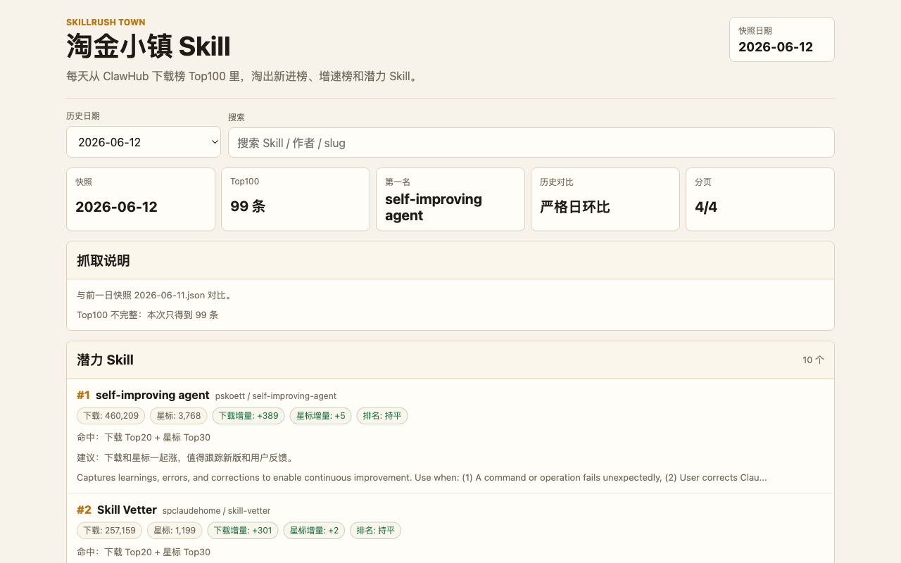

# 淘金小镇 Skill

[](https://skills.sh/LearnPrompt/skillrush-town)
[](LICENSE)
[](https://learnprompt.github.io/skillrush-town/)

中文名叫淘金小镇，英文名叫 **Skillrush Town**。

每天早上，小镇公告板会贴出 ClawHub 下载榜 Top100。这里不只看谁排第一，更关心谁突然冒出来了：新进榜、下载涨得快、星标涨得快、排名往上窜。

[](https://learnprompt.github.io/skillrush-town/)

这些 Skill 可能还很粗糙，但值得看一眼。淘金就是这样。

## 快速开始

一行装进你的 Agent（Claude Code / Codex / Cursor 等 41 个 Agent 通用）：

```bash
npx skills add LearnPrompt/skillrush-town -g
```

实测输出（2026-06-13）：装到 `~/.agents/skills/skillrush-town`，并自动 symlink 到本机已有的 Agent 目录；skills.sh 安全评估为 Gen Safe / Socket 0 alerts。

装完第一句话可以这样说：

```text
今天淘金小镇有什么？帮我总结 Top10 和潜力 Skill。
```

但淘金小镇不应该只是一个榜单网页。

如果只是把 ClawHub Top100 展示出来，那做成普通 GitHub Pages 就够了。它真正值得做成 Skill 的地方，是把「发现一个公开信息源、固定抓取口径、每天留快照、做历史对比、生成报告、提醒用户」这整套路线沉淀下来。

ClawHub Top100 是第一个矿点，因为它有真实运行态请求、Convex path、`nextCursor` 翻页和 Top100 拼接，足够复杂，适合拿来打样。后面同样可以接入 Claude Code changelog 这类更新日志，或者 Artificial Analysis 模型排行榜这类动态榜单。

网页是公告板，Skill 是淘金方法。

## 你可以怎么用

| 你想做什么 | 入口 |
| --- | --- |
| 直接看榜 | 打开 GitHub Pages 页面 |
| 订阅日报 | Atom feed：[learnprompt.github.io/skillrush-town/feed.xml](https://learnprompt.github.io/skillrush-town/feed.xml)，每天一条（Top3 + 潜力数） |
| 回看某一天 | 用页面顶部日期选择，或访问 `?date=YYYY-MM-DD` |
| 做自己的小镇 | fork 仓库，保留 GitHub Actions |
| 交给 Codex / Claude | 使用 `skills/skillrush-town/SKILL.md` |
| 拓展新矿点 | 先写 `skills/skillrush-town/references/source-contract-<source>.md`，再做抓取和对比 |

可以拓展的矿点类型：

- 榜单翻页型：ClawHub Top100 这种需要固定排序、连续翻页、拼接完整榜单的来源。
- 更新日志型：Claude Code changelog 这种每天观察有没有新版本、新功能、新限制的来源。
- 模型排行型：Artificial Analysis 模型排行榜这种需要跟踪模型、价格、速度、指标变化的来源。

每接入一个新矿点，都必须先写清楚 source contract，不能先写爬虫再补解释。

## 当前数据

- 第一份快照：`data/snapshots/2026-05-04.json`
- 最新快照：`data/latest.json`
- 日期索引：`data/dates.json`
- 日报归档：`data/reports/2026-05-04.md`

## 给 Agent 和脚本的数据接口

所有数据都是静态 JSON / Markdown，直接 GET `https://learnprompt.github.io/skillrush-town/<路径>` 即可，无需鉴权。

**兼容承诺：字段只增不改不删。** 已有字段的名字和语义不会变；新需求只会加新字段。如果 ClawHub 上游被迫破坏这个承诺，会在 `limitations` 和日报里写明。

### `data/latest.json` 与 `data/snapshots/<date>.json`

两者结构完全相同，`latest.json` 是最新一天的副本。顶层字段：

| 字段 | 类型 | 说明 |
| --- | --- | --- |
| `snapshot_date` | string | 快照日期 `YYYY-MM-DD` |
| `fetched_at` | string | 抓取时间，ISO 8601 UTC（`Z` 结尾） |
| `source` | object | 抓取口径：`url`、`api`、`path`、`args`（`sort`/`dir`/`nonSuspiciousOnly`/`highlightedOnly`/`numItems`）、`page_size`、`pages_requested`、`pages_succeeded`、`diagnostics.get_api_v1_skills` |
| `comparison_basis` | object | 对比口径：`primary_ranking`、`compare_key`、`previous_snapshot`（string 或 null）、`strict_daily`（bool，是否严格日环比）、`note` |
| `limitations` | string[] | 本次抓取与对比的已知限制 |
| `dropped_items` | object[] | 掉出 Top100 的条目（沿用前一天快照里的 item 结构） |
| `items` | object[] | 榜单条目，最多 100 条，按 `rank` 升序 |

`items[]` 单条字段：

| 字段 | 类型 | 说明 |
| --- | --- | --- |
| `rank` | int | 当日排名，从 1 开始 |
| `name` / `author` / `slug` | string | 名称、作者 handle、slug |
| `downloads` / `installs` / `stars` / `versions` | int 或 null | 规整后的整数指标 |
| `downloads_raw` / `installs_raw` / `stars_raw` | 原始值 | 接口原样保留，可能是 float |
| `latest_version` | string 或 null | 最新版本号 |
| `summary` | string 或 null | 接口返回的简介 |
| `compare_key` | string | 跨日对比主键：slug，缺失时退化为 `author/name` 小写 |
| `prev_rank` | int 或 null | 上一快照排名；null 表示新进榜或无历史 |
| `download_delta` / `star_delta` | int 或 null | 与上一快照的下载/星标增量 |
| `rank_change` | int 或 null | `prev_rank - rank`，正数表示上升 |

### `data/dates.json`

| 字段 | 类型 | 说明 |
| --- | --- | --- |
| `latest` | string | 最新快照日期 |
| `dates` | string[] | 全部可用日期，倒序（最新在前） |

### `data/reports/<date>.md`

人类可读日报，固定章节顺序：抓取状态、限制说明、新进榜、掉榜、Top10 变动、下载增速 Top10、星标增速 Top10、潜力 Skill。潜力区每个条目含名称、作者、slug、命中原因、排名变化、下载/星标增量、建议；2026-06-13 之后还附入选徽章 markdown。

### `feed.xml`

Atom 订阅源，最近 14 天每天一条 entry，内容为 Top3 + 潜力 Skill 数，链接指向 `?date=<date>` 页面。

## 页面能力

- 今日 Top10
- 潜力 Skill
- 下载增速 Top10
- 星标增速 Top10
- 新进榜
- 掉榜
- 完整 Top100
- 历史日期回看
- 抓取限制说明

第一次运行没有历史切片，所以不会假装有严格日环比。等连续跑两天后，下载增量、星标增量、排名变化才有意义。

## 入选徽章

从 2026-06-13 之后的日报开始，每个入选「潜力 Skill」的项目在 `data/reports/<date>.md` 里都会附带一段可复制的徽章 markdown，长这样：

[](https://learnprompt.github.io/skillrush-town/?date=2026-06-13)

你的 Skill 上榜了？把日报里那段 markdown 贴进你的 README，徽章会链回上榜当天的公告板页面。历史报告不回填，只对新日报生效。

## 安装后怎么用

这个 Skill 本身不会在安装瞬间偷偷创建定时任务。更稳的做法是：安装后第一次使用时，让 Agent 明确帮你完成一次检查，并询问或执行提醒配置。

### 给 Hermes

```text
请使用 skillrush-town，检查今天的 ClawHub Top100，并帮我设置每天上午 10 点提醒。
```

如果你只想手动检查一次：

```text
请使用 skillrush-town，读取 latest.json，总结今天 Top10 和潜力 Skill。
```

### 给 Codex / Claude Code

在 fork 后的项目根目录里说：

```text
请读取 AGENTS.md / CLAUDE.md，并按照 skills/skillrush-town/SKILL.md 验证这个项目。
不要依赖浏览器，先跑 headless validation。
```

### 提醒机制

项目自己的 GitHub Actions 负责每天更新数据；用户提醒属于个人 Agent 侧能力。Hermes 可以用 cron job 每天读取 `data/latest.json` 后发消息；Codex / Claude Code 通常不自带常驻提醒，需要交给 GitHub Actions、系统 cron 或外部 Agent。

## 本地预览

```bash
python -m http.server 8093
```

打开：

```text
http://127.0.0.1:8093/
```

查看某天：

```text
http://127.0.0.1:8093/?date=2026-05-04
```

## 手动更新

```bash
python scripts/clawhub_daily.py --date 2026-05-04
```

脚本会更新：

- `data/snapshots/YYYY-MM-DD.json`
- `data/reports/YYYY-MM-DD.md`
- `data/latest.json`
- `data/dates.json`

## 抓取失败告警

每日定时跑如果失败，GitHub Actions 会自动开（或追加评论到）一个带 `scrape-failure` label 的 issue，标题含日期、正文带 run 链接，同一个 open issue 不会重复开新的。零额外 secret，只用仓库自带的 `GITHUB_TOKEN`。

想把告警接到自己的 IM：在 GitHub 上 Watch 本仓库（Custom → Issues）让通知走邮件/手机 App，或在你自己的服务里给本仓库配 issue 事件的 Webhook 转发到 IM——凭据放你自己那边，仓库里不存任何 IM token。

## 抓取口径

主榜单固定使用页面运行态真实请求：

```text
POST https://wry-manatee-359.convex.cloud/api/query
path=skills:listPublicPageV4
sort=downloads
dir=desc
nonSuspiciousOnly=true
highlightedOnly=false
numItems=25
```

通过 `nextCursor` 连续翻 4 页，拼出 Top100。

`GET /api/v1/skills` 只做诊断，不作为主榜单接口。它如果返回空 `items`，不代表页面没有榜单。

## 诚实边界

- ClawHub 可能改 Convex path 或字段名。
- 第一次运行没有历史切片，不能写成日环比。
- 如果分页失败，快照和日报必须写明。
- 如果你 fork 后接入别的来源，要新增 `skills/skillrush-town/references/source-contract-<source>.md`；只有替换默认 ClawHub 来源时才更新 `source-contract.md`。

## 给 Agent 的入口

项目 Skill 在：

```text
skills/skillrush-town/SKILL.md
```

让新 Agent 接手时，可以这样说：

```text
请读取这个仓库，并使用 skills/skillrush-town/SKILL.md。
先检查 README.md、scripts/clawhub_daily.py、data/dates.json、skills/skillrush-town/references/source-contract.md。
请验证 Skillrush Town 是否能抓取 ClawHub Top100、生成历史快照、渲染 GitHub Pages，并指出发布前还缺什么。
```

---

<div align="center">

**更多好用 Skill · More Skills** → [learnprompt.pro/skills](https://learnprompt.pro/skills/)

[鲁班·Skill打磨](https://github.com/LearnPrompt/luban-skill) · [庖丁·博主蒸馏](https://github.com/LearnPrompt/paoding-skill) · [蔡伦·对话造纸](https://github.com/LearnPrompt/cailun-skill) · [阿福·LLM Todo](https://github.com/LearnPrompt/afu-llm-todo) · [愚公·Loop工程](https://github.com/LearnPrompt/loop-engineering) · [搭子·结对开发](https://github.com/LearnPrompt/partner-skill) · [AI雷达·零API资讯](https://github.com/LearnPrompt/ai-news-radar)

[淘金小镇·ClawHub日榜](https://github.com/LearnPrompt/skillrush-town) · [Irasutoya·正文配图](https://github.com/LearnPrompt/carl-irasutoya-illustrations) · [Humanize PPT·演讲系统](https://github.com/LearnPrompt/humanize-ppt) · [CC Harness·六件套](https://github.com/LearnPrompt/cc-harness-skills) · [微信读书教练](https://github.com/LearnPrompt/carl-weread) · [X Article发布](https://github.com/LearnPrompt/x-article-publisher-skill)

<sub>**[LearnPrompt](https://github.com/LearnPrompt) 出品** · 公众号「卡尔的AI沃茨」 · [X @aiwarts](https://x.com/aiwarts)</sub>

</div>
